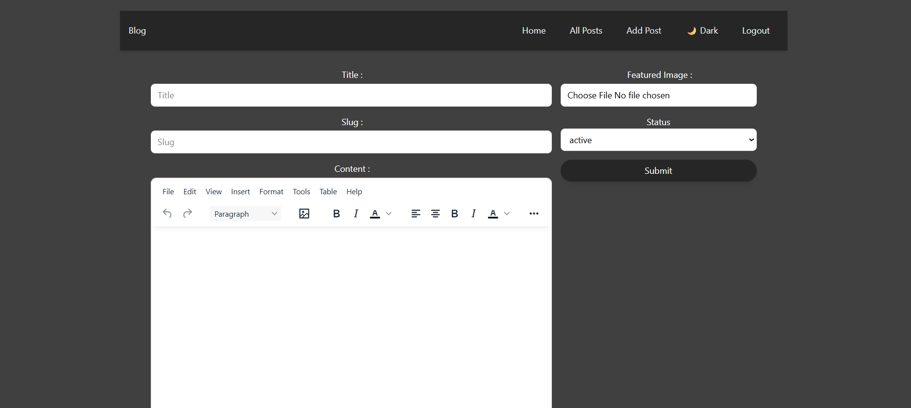
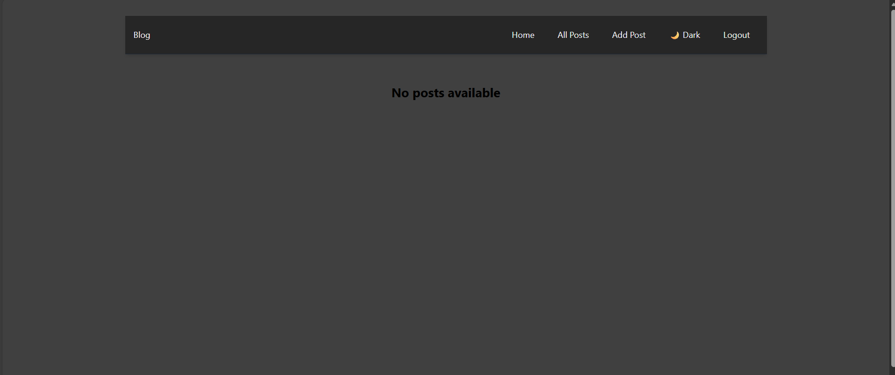
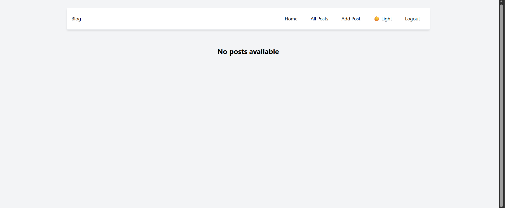
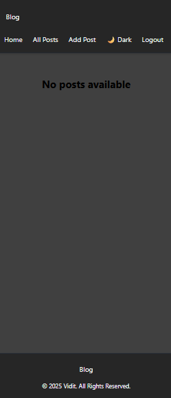

📖 Blog Project

🚀 Live Demo : https://blog-hazel-chi-54.vercel.app

📌 Overview
A modern blog application built with React 19 + Vite 7 and styled using Tailwind CSS 4.
It integrates Appwrite for backend services, Redux Toolkit for state management, and TinyMCE for rich text editing.
Designed for readability, accessibility, and fast performance with responsive layouts, dark mode palettes, and optimized image rendering.

## ✨ Features

- 📝 **Rich Text Editor** – TinyMCE integration for creating and formatting polished blog posts
- 🔐 **Authentication & Backend** – Secure user management and data storage powered by Appwrite
- 🌗 **Dark Mode Palette** – Layered backgrounds and accessible input styling for inclusive design
- 📱 **Responsive Layouts** – Tailwind CSS with tuned wrapper widths for readability across all devices
- ⚡ **Performance** – Optimized builds and fast load times with Vite bundling
- 🧩 **State Management** – Redux Toolkit for managing posts, authentication, and UI state
- 🔀 **Routing** – SPA navigation implemented with React Router DOM v7
- ✅ **Form Handling** – React Hook Form integrated with Redux Toolkit for validation, error handling, and smooth UX
- 🖼️ **HTML Rendering** – Safe rendering of editor output using html-react-parser with sanitization best practices
- 🛠️ **Tooling & Deployment** – Vite dev server, ESLint for linting, and Vercel for production hosting

🛠️ Tech Stack

- Frontend: React 19, Vite 7
- Styling: Tailwind CSS 4, @tailwindcss/vite plugin
- Editor: TinyMCE React
- Backend: Appwrite
- State Management: Redux Toolkit, React Redux, React Hook Form
- Routing: React Router DOM v7
- Utilities: html-react-parser for rendering HTML safely
- Linting: ESLint + React Hooks & Refresh plugins

## 🔐 Environment Variables

Create a `.env` file at the project root or configure environment variables in your deployment platform (e.g., Vercel).  
The following variables are required:

- **APPWRITE_ENDPOINT** — Appwrite server URL
- **APPWRITE_PROJECT_ID** — Appwrite project ID
- **APPWRITE_API_KEY** — Appwrite API key for server operations (**keep secret**)
- **VITE_APPWRITE_ENDPOINT** — frontend endpoint variable used in client code
- **VITE_APPWRITE_PROJECT_ID** — frontend project ID used in client code

### ⚠️ Security Notes

- Never commit `.env` files to version control.
- Use your hosting provider’s secret manager (e.g., Vercel Environment Variables) for production.
- Ensure CORS settings in Appwrite allow requests from your deployed domain.

## 📂 Project Structure

```
BLOG/
├── public/                  # Static assets
├── screenshots/             # Screenshots for README
├── src/
│   ├── appwrite/            # Appwrite SDK integration (auth, storage, database)
│   ├── components/          # Reusable UI components
│   ├── conf/                # Configuration files (e.g., TinyMCE setup)
│   ├── pages/               # Route-based pages (Home, Post, Editor, Auth)
│   ├── store/               # Redux slices and store setup
│   │   ├── authSlice.js
│   │   └── store.js
│   ├── theme/               # Dark mode logic
│   │   ├── themeSlice.js
│   │   └── useTheme.js      # Custom hook for toggling dark mode
│   ├── App.jsx              # Root component
│   ├── index.css            # Global styles
│   └── main.jsx             # Entry point
├── .env.sample              # Sample environment variables
├── .env                     # Actual environment variables (not committed)
├── .gitignore               # Git ignore rules
├── eslint.config.js         # ESLint configuration
├── index.html               # HTML template
├── package.json             # Project metadata and dependencies
├── package-lock.json        # Dependency lock file
├── README.md                # Project documentation
├── vercel.json              # Vercel deployment config
└── vite.config.js           # Vite build configuration
```

## ⚙️ Project Setup

### 📋 Requirements

- Node.js 18+ recommended
- npm 9+ or yarn

### 🔧 Installation

```bash
# Clone the repository
git clone https://github.com/ViditTyagi17/Blog.git

# Navigate to project folder
cd Blog

# Install dependencies
npm install

# Run development server

npm run dev

# Build for production

npm run build

# Preview production build

npm run preview

# Lint codebase

npm run lint
```

## 📸 Screenshots

### Editor View



### Dark Mode



### Light Mode



### Mobile Layout



## 🔑 Key Implementation Notes

### 📝 TinyMCE Integration

- TinyMCE is used for rich text editing in the post editor.
- Toolbar and plugins are configured in the editor component to match UX needs.
- Editor output is sanitized server‑side and rendered safely client‑side using **html-react-parser**.

### 🔐 Appwrite Integration

- Appwrite handles authentication, database, and file storage.
- The Appwrite SDK is used to sign in users, create sessions, and upload images to storage buckets.
- Ensure **CORS** and endpoint settings are properly configured in the Appwrite console for your domain.

### 🧩 State Management

- **Redux Toolkit** organizes slices for posts, authentication, and UI state.
- **React Hook Form** is used for editor and auth forms, providing validation and performance.

### 🎨 Tailwind & Responsive Layouts

- Wrapper widths tuned for readability across breakpoints using `max-w-` utilities and `prose` classes.
- Dark mode implemented with Tailwind’s `dark` class strategy, ensuring accessible color contrast.

---

🧑‍💻 Author

- Vidit – Aspiring Web Developer
- Portfolio: [your-portfolio-link]
- GitHub: https://github.com/ViditTyagi17

📜 License
This project is licensed under the MIT License.
